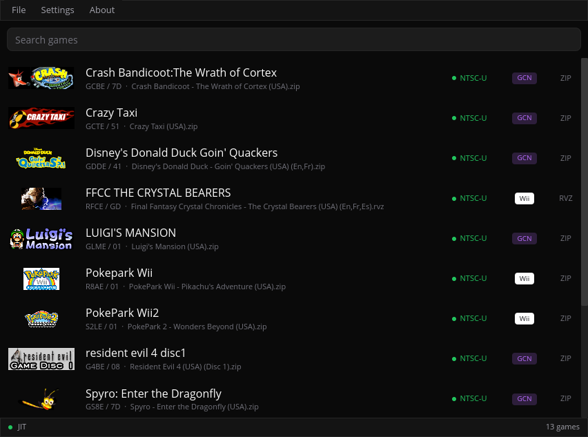

<div align="center">

# Gecko

A cross-platform GameCube/Wii emulator and debugger written in Rust.


  
  

</div>

## Status

Gecko is still in development. While many games work well, most will likely have varying degrees of visual glitches or will be outright broken. Refer to the screenshot databases to gauge compatiblity:
- [GameCube](https://emu.layle.dev/gecko-gc/4ad1a63/)
- [Wii](https://emu.layle.dev/gecko-wii/4ad1a63/)

Note: Only NTSC games are tracked. The screenshot service makes a best effort attempt to enter games by pressing random buttons. Just because a game doesn't go ingame, doesn't mean it actually doesn't.

## Features

Gecko is developed with homebrew development and reverse engineering in mind, but also aims to provide a faithful and playable experience!

- PowerPC JIT (Cranelift)
- DSP JIT (Cranelift)
- GX vertex decode JIT (Cranelift)
- Starlet HLE
- IPL skip patches for NTSC and PAL
- `wgpu` based renderer backend
  - Supports all major platforms
- `wesl` based specialized shader compiler
- JIT and shader cache
- FIFO recorder & player
  - Compatible with Dolphin
- Frame pacing
- Modular audio backend, defaults to `cpal`
  - Supports mixing audio sinks
  - Supports dumping to .wav files
- MCP server
- Lua scripting system for runtime introspection
- A beautiful yet advanced egui-based debugging UI
- Symbol parsing from ELFs and IDA Pro databases
- IDA Pro loaders for DOL and Apploader
- RenderDoc captures with all sorts of debug markers
- ISO and RVZ support; also supports either packed as a ZIP
- Included multitool, supports:
  - IPL decode/encode
  - SYSCONF decode/encode
  - setting.txt decode/encode
  - DVD filesystem extraction
  - Disassembler for PPC and DSP
- Various built-in diagnostics for JIT and GX
- [Support for web browser](https://gecko.layle.dev)
  - [incl. debugging capabilities](https://gecko.layle.dev/dbg)

There is currently **no way to save games** for GameCube. Wii save games are supported naturally via NAND.

## Usage
Prebuilt releases (including debug builds) can be downloaded [here](https://github.com/ioncodes/gecko/releases). GameCube and Wii require system files to use the emulator, please refer to the ["Required Files"](https://github.com/ioncodes/gecko#required-files) chapter. Minimal commands to launch a game:

```sh
# Launch a GameCube game
./tinyapp --ipl IPL.decoded.bin --dsp dsp_rom.bin --coef dsp_coef.bin --skip-ipl --dvd YourGame.rvz

# Launch a Wii game
./tinyapp --dsp dsp_rom.bin --coef dsp_coef.bin --dvd YourGame.rvz
```

A more modern and friendly experience is provided via `gecko` ([short preview on YouTube](https://www.youtube.com/watch?v=wg62ie71JP0)):



It scans the configured GameCube and Wii folders for `.iso`, `.rvz` and `.zip` files. Double-clicking on a row opens a dedicated player window for that game. The decoded GameCube IPL and DSP files are expected to be inside the `system` folder and **must** be named exactly as follows:

```
<gecko exe dir>/
  config.toml                # settings
  cache/library.bin          # cached library
  system/                    # system file folder (!)
    IPL.bin                  # GameCube only
    dsp_rom.bin              # GameCube and Wii
    dsp_coef.bin             # GameCube and Wii
  fs/                        # Wii NAND, auto-generated if missing (or drop in a Dolphin/real dump)
```

### Controls

Keybindings are currently hardcoded!

#### GameCube

| Key             | Action                     |
| --------------- | -------------------------- |
| Arrow keys      | Main stick                 |
| `I` `K` `J` `L` | D-pad (up/down/left/right) |
| `X`             | A                          |
| `Z`             | B                          |
| `C`             | X                          |
| `V`             | Y                          |
| `Enter`         | Start                      |
| `A`             | L                          |
| `S`             | R                          |
| `D`             | Z                          |

#### Wii

Wiimote:

| Input          | Action         |
| -------------- | -------------- |
| Mouse movement | IR pointer     |
| Left mouse     | A              |
| Right mouse    | B              |
| Arrow keys     | D-pad          |
| `1`            | 1              |
| `2`            | 2              |
| `Home`         | Home           |
| `-`            | Minus          |
| `=`            | Plus           |
| `Left Shift`   | Shake (motion) |

Nunchuk:

| Key             | Action       |
| --------------- | ------------ |
| `W` `S` `A` `D` | Analog stick |
| `Q`             | Z            |
| `E`             | C            |

#### Global

| Key     | Action                                                             |
| ------- | ------------------------------------------------------------------ |
| `Space` | Start emulation from the splash screen (`--wait` flag)             |
| `F10`   | Trigger a RenderDoc capture (requires `renderdoc-capture` feature) |
| `F11`   | Screenshot the full window                                         |
| `F12`   | Screenshot the emulated framebuffer only                           |

## Projects
This is a table of the main projects. Refer to `crates/` to find out about all available projects.

| Crate        | Description                                                                                                                     |
| ------------ | ------------------------------------------------------------------------------------------------------------------------------- |
| `app`        | End-user library browser (binary name `gecko`): iced-based game list, double-click to play, per-game player window              |
| `tinyapp`    | Lightweight emulator application with an egui/wgpu GUI, optional Lua scripting                                                  |
| `debugger`   | Interactive GUI debugger built on egui with rendering support, hooks and scripting capabilities                                 |
| `web`        | WebAssembly build of the emulator for browser deployment via wasm-bindgen, with optional debug UI                               |
| `multitool`  | CLI utility for analyzing, disassembling and extracting GC/Wii binaries/images (DOL, IPL, ISO/RVZ) with support for PPC and DSP |
| `fifoplayer` | Plays a recorded `.dff` fifo log. Supports replays generated from Dolphin and Gecko's debugger                                  |

## Building

```sh
git submodule init && git submodule update

cargo build -p gecko-app --release                               # game launcher (binary: gecko)
cargo build -p tinyapp --release                                 # tinyapp
cargo build -p debugger --release                                # debugger
cargo build -p multitool --release                               # multitool
cargo build -p fifoplayer --release                              # fifo player
wasm-pack build crates/web --target web --out-dir pkg --release  # web version
```

> Release builds compile out all tracing output (the `gecko` crate pins `tracing` with `release_max_level_off`), so `--release` binaries are silent. Build with `--profile dev` if you want log messages.

### Features

Features below are listed based on the frontend crate that supports them. Most of them are simply forwarded into the core `gecko` and `backend-wgpu` crates,
so the underlying flag of the same name is what actually toggles the behavior. For exact build invocations refer to the GitHub CI actions file.

#### `tinyapp`

| Flag                  | Default | Description                                                                                                     |
| --------------------- | :-----: | --------------------------------------------------------------------------------------------------------------- |
| `fps-counter`         |   on    | Emulator-core driven FPS counter (forwards `gecko/fps-counter`).                                                |
| `scripting`           |   off   | Enables Lua scripting support and the `--script` CLI option (pulls in `gecko/hooks` + the `scripting` crate).   |
| `scripting-mut-traps` |   off   | Implies `scripting`: lets scripted hooks re-register themselves at runtime (`gecko/hooks-mut-traps`).           |
| `audio-wav-dump`      |   off   | Forwards `gecko/audio-wav-dump`: write all emulated audio to a `.wav` sink while running.                       |
| `renderdoc-capture`   |   off   | Forwards `backend-wgpu/renderdoc-capture`: load the RenderDoc in-app API and emit debug markers.                |
| `jit-stats`           |   off   | Forwards `gecko/jit-stats`: per-block PPC JIT stats, block-frequency CSV dumps and more.                        |
| `gx-stats`            |   off   | Forwards `gecko/gx-stats`: GX submission and draw-call counters surfaced by the core.                           |
| `profile`             |   off   | Forwards `gecko/profile`: in-process profiler (Windows-only kernel IP sampler).                                 |
| `hotpath`             |   off   | Compiles `hotpath::measure` instrumentation into the core and the wgpu backend; reports on shutdown.            |
| `hotpath-alloc`       |   off   | Implies `hotpath`: swaps the global allocator for a counting allocator that attributes allocs to hot functions. |
| `hotpath-cpu`         |   off   | Implies `hotpath`: samples CPU time per measured function via `hotpath/hotpath-cpu`.                            |
| `hotpath-tui`         |   off   | Implies `hotpath`: renders the live `hotpath` TUI instead of dumping a report on exit.                          |

#### `debugger`

`debugger` always builds with `gecko/hooks`, `gecko/audio-wav-dump`, `image/symbols` (ELF/IDA symbol parsing), and the full `scripting` crate enabled.

| Flag                  | Default | Description                                                                                                       |
| --------------------- | :-----: | ----------------------------------------------------------------------------------------------------------------- |
| `scripting-mut-traps` |   off   | Same as in `tinyapp`: re-registerable scripted hooks (`gecko/hooks-mut-traps` + `scripting/hooks-mut-traps`).     |
| `renderdoc-capture`   |   off   | Forwards `backend-wgpu/renderdoc-capture`. With this enabled, F10 triggers a RenderDoc capture of the next frame. |

#### `gecko`

| Flag                  | Default | Description                                                                                                            |
| --------------------- | :-----: | ---------------------------------------------------------------------------------------------------------------------- |
| `jit`                 |   on    | Cranelift-backed JIT for Gekko, DSP, and GX vertex decode. Without it the core falls back to interpreters.             |
| `hooks`               |   off   | Memory/instruction trap hook surface used by `scripting`, the `debugger`, and tooling like `dsptestrunner`.            |
| `hooks-mut-traps`     |   off   | Implies `hooks`: allows hooks to mutate trap state.                                                                    |
| `audio-wav-dump`      |   off   | Compiles the `hound`-backed `.wav` audio sink.                                                                         |
| `fps-counter`         |   off   | Compiles the core FPS counter for more accurate measurements.                                                          |
| `jit-stats`           |   off   | Implies `jit`: per-block JIT hit counts, idle-skip stats, CSV dumps (pulls in `backtrace`).                            |
| `gx-stats`            |   off   | GX command-processor / BP / XF submission counters.                                                                    |
| `vtx-jit-validate`    |   off   | Implies `jit` + `gx-stats`. Runs both the GX vertex JIT and interpreter for every draw and reports drift between them. |
| `profile`             |   off   | Per-block PPC/DSP heatmap profiler; on Windows it also enables a kernel-IP sampler via `windows-sys`.                  |
| `rendersink-blackbox` |   off   | Wraps `EmptyRenderSink::exec` in `std::hint::black_box`. Useful for benchmarking.                                      |
| `hotpath`             |   off   | Compiles `hotpath::measure` instrumentation across the core hot loops.                                                 |

#### `backend-wgpu`

| Flag                | Default | Description                                                                        |
| ------------------- | :-----: | ---------------------------------------------------------------------------------- |
| `renderdoc-capture` |   off   | Pulls in the `renderdoc` crate and enables the in-app capture API + debug markers. |
| `hotpath`           |   off   | Instruments the wgpu sink (incl. crossbeam channels) for `hotpath` reporting.      |

#### `web`

| Flag    | Default | Description                                                                                                                              |
| ------- | :-----: | ---------------------------------------------------------------------------------------------------------------------------------------- |
| `debug` |   off   | Bundles the in-browser debugger UI (pulls in `dbglib` and `egui-phosphor`). Enabled for the [`/dbg`](https://gecko.layle.dev/dbg) build. |

#### `tinybench`

| Flag        | Default | Description                                                                                       |
| ----------- | :-----: | ------------------------------------------------------------------------------------------------- |
| _(default)_ |    —    | Forwards `gecko/rendersink-blackbox` so the renderless benchmark loop doesn't get optimized away. |
| `jit-stats` |   off   | Forwards `gecko/jit-stats` for benchmarking.                                                      |

## Required files

Gecko does not ship any system files.  

Reference SHA-256 hashes (these are the files the project is developed against):

| File                         | SHA-256                                                            |
| ---------------------------- | ------------------------------------------------------------------ |
| `IPL.bin` (NTSC, encoded)    | `7228bd8f0171008e71c48788eef5e0fd5abce8ef85f1d00327c6f3368113d2a5` |
| `IPL.decoded.bin` (NTSC)     | `31e9aa82d972a423d9b7ea7bdbdcff0aff86c3ed953600ca841fe24f3f577051` |
| `PAL_IPL.bin` (PAL, encoded) | `a5fd3ab0ed3d63ad365990cbf522f9f175e01d3b37e5f30a8e5a103cbbc749fd` |
| `PAL_IPL.decoded.bin` (PAL)  | `011b66ce68d8dcb4f37460fcb322215bcda7df79072aeca22fdc690499deabac` |
| `dsp_rom.bin`                | `49d987ee1eab29a157425b82d54516957a81e1bac247c8834e494642605c3e8c` |
| `dsp_coef.bin`               | `d7741279c2e8ec5c5fb318f8fbdd6de6bf583520d288e836a5383233a4238179` |

### GameCube
- IPL (NTSC and PAL tested)
- DSP IROM
- DSP coefficient ROM

If you only have an encoded IPL, decode it first with multitool:

```sh
multitool ipl --action decode private/IPL.bin private/IPL.decoded.bin
```

### Wii
A NAND is generated on boot whenever `fs/` is missing. The folder can be overriden using the `GECKO_FS_ROOT` environment variable.

```sh
# optional!
GECKO_FS_ROOT=/path/to/dolphin-nand tinyapp --dvd wii_game.rvz # ... and other arguments
```

## Usage
Example invocations:

```sh
multitool ipl --action decode ipl.encoded.bin ipl.decoded.bin
multitool sysconf --action decode fs/shared2/sys/SYSCONF SYSCONF.txt  # edit, then re-encode
multitool sysconf --action encode SYSCONF.txt fs/shared2/sys/SYSCONF
multitool setting --action decode fs/title/00000001/00000002/data/setting.txt setting.decoded
multitool setting --action encode setting.decoded fs/title/00000001/00000002/data/setting.txt
multitool dvd --extract game.rvz

tinyapp --dol homebrew.dol  # may also require a DSP depending on the DOL
tinyapp --dvd game.iso --ipl ipl.decoded.bin --dsp dsp_rom.bin --coef dsp_coef.bin --skip-ipl

debugger --dvd game.rvz --ipl ipl.decoded.bin --dsp dsp_rom.bin --coef dsp_coef.bin --script example.lua
```

The CLI options are largely the same across the sub projects (such as the debugger). For more options, see `--help`.

## Why?
Why do we get a new Wii emulator? Well, it all started a few years ago. I wanted to do something nostalgic and as a kid I spent countless hour in this one Wii game called *Final Fantasy Crystal Chronicals: The Crystal Bearers*. It wasn't a well received game but I loved it so much, I chose my online persona "Layle" after the main protagonist. I figured it would be cool to spend some years learning about emulation development with the goal to eventually run the game in my own emulator!

## Sister Projects
Gecko is being developed alongside other amazing emulators that shaped how Gecko came to be. Without them, Gecko wouldn't exist!

- [lazuli](https://github.com/vxpm/lazuli) by vxpm
- [solstice](https://codeberg.org/hazelwiss/solstice) by hazelwiss
- [beanwii](https://github.com/zaydlang/beanwii) by zayd

Besides these "sister projects", [Dolphin](https://github.com/dolphin-emu/dolphin) has also been a major contributor in many ways.