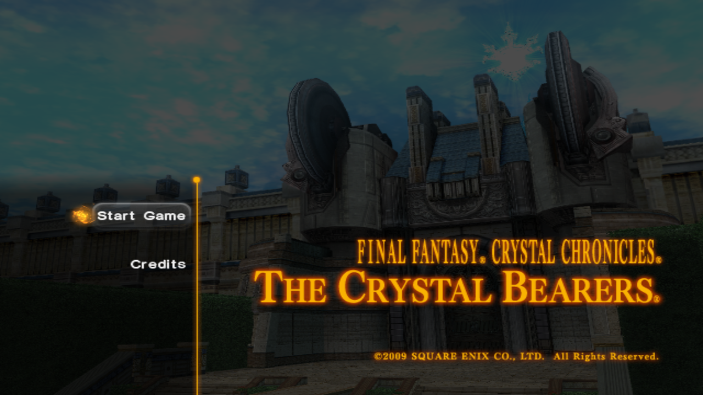
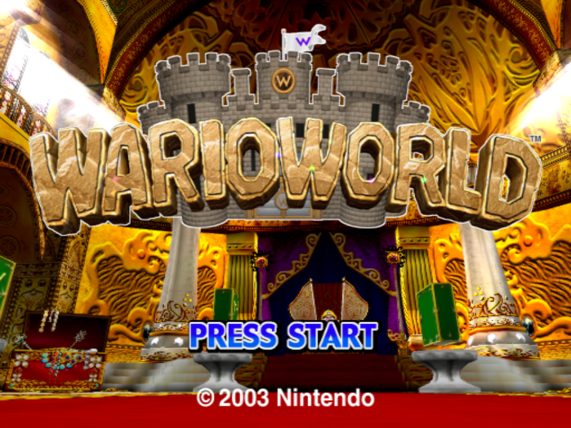
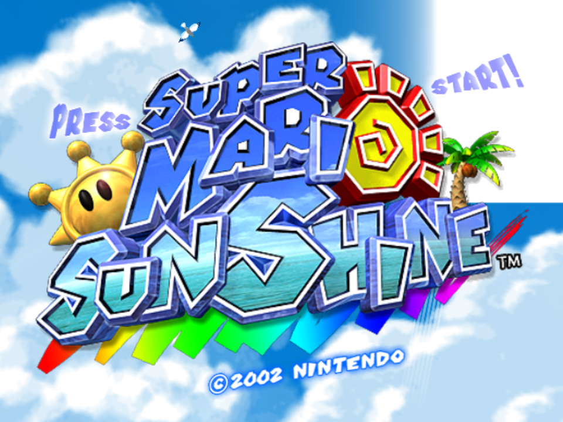
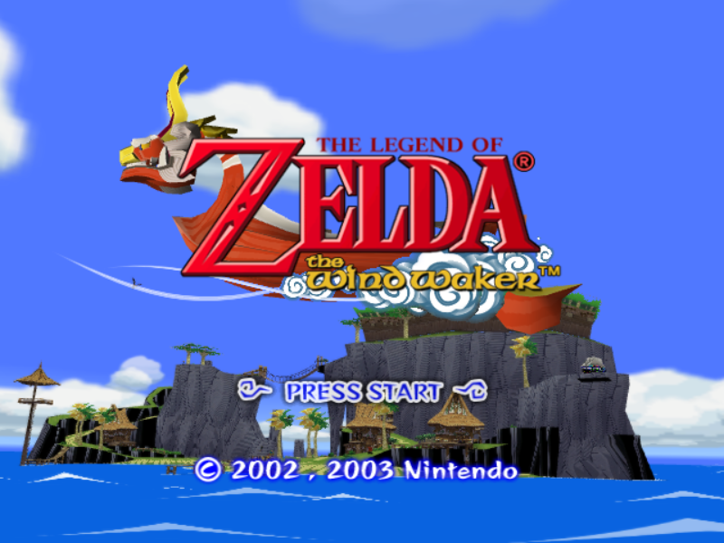
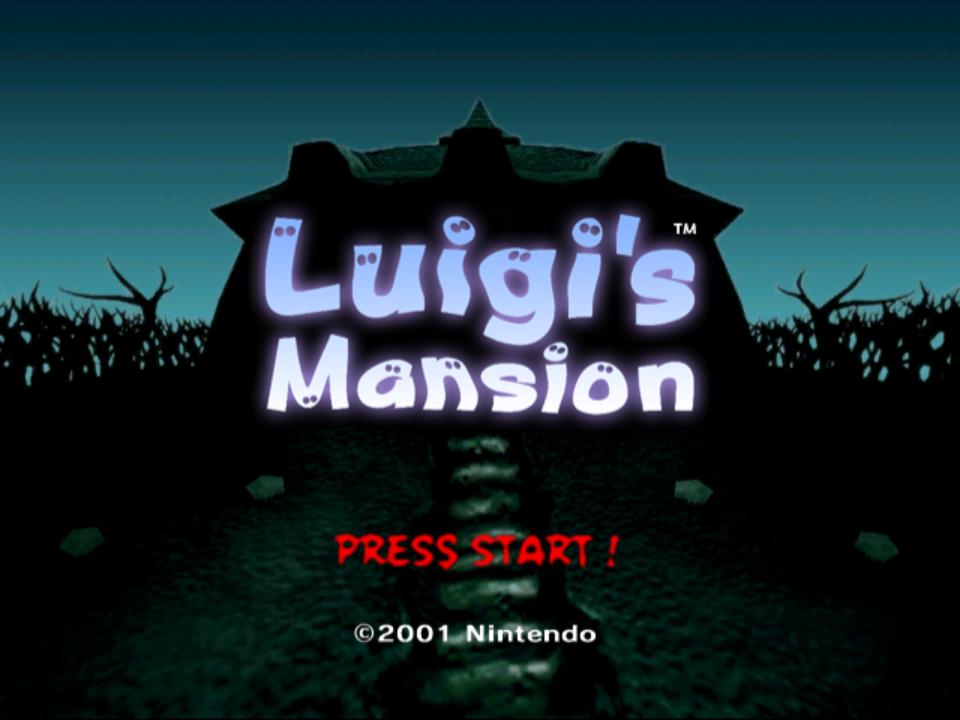
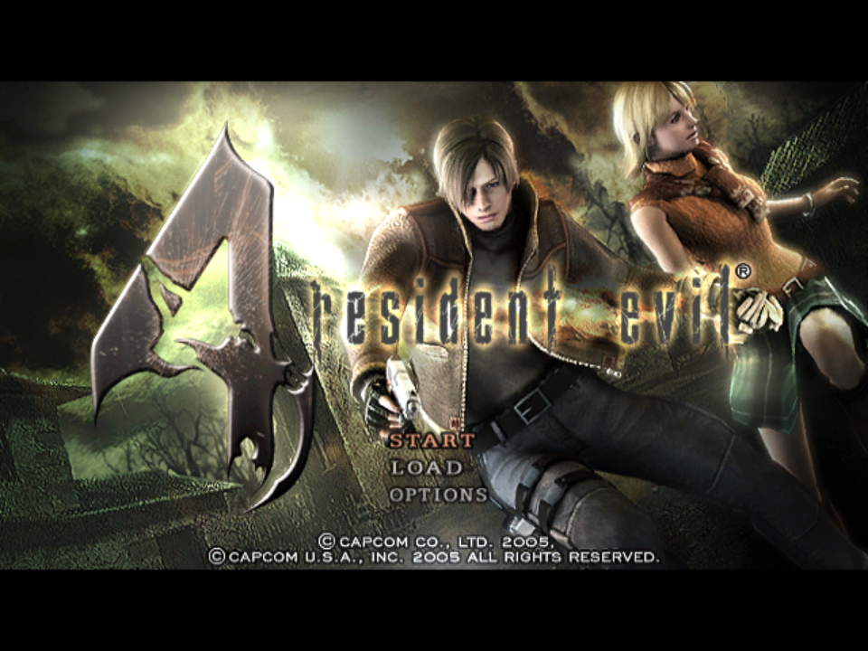
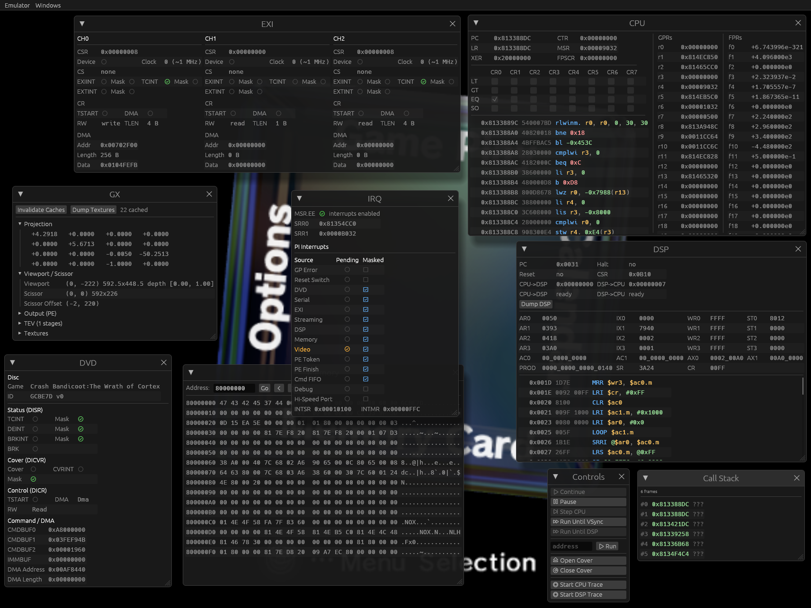

<div align="center">

# Gecko

A cross-platform GameCube/Wii emulator and debugger written in Rust.



  
  

</div>

## Status

Gecko is still in development. Support may vary, while many games work very well, most will likely either have varying degrees of visual glitches or are outright broken. Refer to the [screenshot database](https://emu.layle.dev/gecko/) to gauge compatiblity. Gecko is developed with homebrew development and reverse engineering in mind.

- PowerPC JIT (Cranelift)
- DSP JIT (Cranelift)
- GX vertex decode JIT (Cranelift)
- Starlet HLE
- IPL skip patches for NTSC and PAL
- `wgpu` based renderer backend
- `wesl` based specialized shader compiler
- Frame pacing
- Modular audio backend, defaults to `cpal`
  - Core speed synced to the audio rate
  - Supports mixing audio sinks
  - Supports dumping to .wav files
- MCP server
- Lua scripting system for runtime introspection
- A beautiful yet advanced egui-based debugging UI
- Symbol parsing from ELFs and IDA Pro databases
- RenderDoc captures with all sorts of debug markers
- ISO and RVZ support; also supports either packed as a ZIP
- Included multitool, supports:
  - IPL decode/encode
  - DVD filesystem extraction
  - Disassembler for PPC and DSP
- Various built-in diagnostics for JIT and GX
- [Support for web browser](https://gecko.layle.dev)
  - [incl. debugging capabilities](https://gecko.layle.dev/dbg)

WIP features:
- IPL HLE backed by [solstice](https://codeberg.org/hazelwiss/solstice)
- Basic Wiimote controls work, but are still flaky and not fully implemented

## Projects
This is a table of the main projects. Refer to `crates/` to find out about all available projects.

| Crate       | Description                                                                                                                     |
| ----------- | ------------------------------------------------------------------------------------------------------------------------------- |
| `tinyapp`   | Lightweight emulator application with an egui/wgpu GUI, optional Lua scripting                                                  |
| `debugger`  | Interactive GUI debugger built on egui with rendering support, hooks and scripting capabilities                                 |
| `web`       | WebAssembly build of the emulator for browser deployment via wasm-bindgen, with optional debug UI                               |
| `multitool` | CLI utility for analyzing, disassembling and extracting GC/Wii binaries/images (DOL, IPL, ISO/RVZ) with support for PPC and DSP |

## Building

```sh
git submodule init && git submodule update

cargo build -p multitool --release                               # multitool
cargo build -p tinyapp --release                                 # main application
cargo build -p debugger --release                                # debugger
wasm-pack build crates/web --target web --out-dir pkg --release  # web version
```

> Release builds compile out all tracing output (the `gecko` crate pins `tracing` with `release_max_level_off`), so `--release` binaries are silent. Build with `--profile dev` if you want log messages.

### Features

| Flag                  | Crates                                                    | Description                                                          |
| --------------------- | --------------------------------------------------------- | -------------------------------------------------------------------- |
| `scripting`           | `tinyapp` (off); always on in `debugger`                  | Lua scripting support and the `--script` option                      |
| `scripting-mut-traps` | `tinyapp` (off), `debugger` (off)                         | Let scripting hooks re-register themselves at runtime                |
| `efb-writeback`       | `tinyapp` (off), `debugger` (off)                         | EFB-to-texture writeback (needed by some games)                      |
| `audio-wav-dump`      | `tinyapp` (off)                                           | Write all emulated audio to `dump.wav` while running                 |
| `renderdoc-capture`   | `debugger` (off)                                          | RenderDoc captures with debug markers, triggered by F10              |
| `fps-counter`         | `tinyapp` (on)                                            | Enables emulator core driven FPS counter                             |
| `jit-stats`           | `tinyapp` (off), `tinybench` (off)                        | Per-block JIT stats and block-frequency CSV dumps                    |
| `gx-stats`            | `tinyapp` (off)                                           | GX submission and draw-call stats                                    |
| `profile`             | `tinyapp` (off)                                           | In-process profiler: per-block PPC/DSP heatmaps + Windows IP sampler |
| `debug`               | `web` (off, on for [`/dbg`](https://gecko.layle.dev/dbg)) | Bundle the in-browser debugger UI                                    |

For exact build invocations refer to the GitHub CI actions file.

## Required files

Gecko does not ship any system files.

### GameCube
- IPL (NTSC and PAL tested)
- DSP IROM
- DSP coefficient ROM

If you only have an encoded IPL, decode it first with multitool:

```sh
multitool ipl --action decode private/IPL.bin private/IPL.decoded.bin
```

### Wii
NAND filesystem dump from Dolphin. Place it under `./fs/` or point `GECKO_FS_ROOT` at the directory:

```sh
GECKO_FS_ROOT=/path/to/dolphin-nand tinyapp --dvd wii_game.rvz
```

Reference SHA-256 hashes (these are the files the project is developed against):

| File                         | SHA-256                                                            |
| ---------------------------- | ------------------------------------------------------------------ |
| `IPL.bin` (NTSC, encoded)    | `7228bd8f0171008e71c48788eef5e0fd5abce8ef85f1d00327c6f3368113d2a5` |
| `IPL.decoded.bin` (NTSC)     | `31e9aa82d972a423d9b7ea7bdbdcff0aff86c3ed953600ca841fe24f3f577051` |
| `PAL_IPL.bin` (PAL, encoded) | `a5fd3ab0ed3d63ad365990cbf522f9f175e01d3b37e5f30a8e5a103cbbc749fd` |
| `PAL_IPL.decoded.bin` (PAL)  | `011b66ce68d8dcb4f37460fcb322215bcda7df79072aeca22fdc690499deabac` |
| `dsp_rom.bin`                | `49d987ee1eab29a157425b82d54516957a81e1bac247c8834e494642605c3e8c` |
| `dsp_coef.bin`               | `d7741279c2e8ec5c5fb318f8fbdd6de6bf583520d288e836a5383233a4238179` |

## Usage
Example invocations:

```sh
multitool ipl --action decode ipl.encoded.bin ipl.decoded.bin
multitool dvd --extract game.rvz
tinyapp --dol homebrew.dol  # may also require a DSP depending on the DOL
tinyapp --dvd game.iso --ipl ipl.decoded.bin --dsp dsp_rom.bin --coef dsp_coef.bin --skip-ipl
debugger --dvd game.rvz --ipl ipl.decoded.bin --dsp dsp_rom.bin --coef dsp_coef.bin --script example.lua
```

The CLI options are largely the same across the sub projects (such as the debugger). For more options, see `--help`.

## Sister Projects
Gecko is being developed alongside other amazing emulators that shaped how Gecko came to be. Without them, Gecko wouldn't exist!

- [lazuli](https://github.com/vxpm/lazuli) authored by vxpm
- [solstice](https://codeberg.org/hazelwiss/solstice) authored by hazelwiss
- [beanwii](https://github.com/zaydlang/beanwii) authored by zayd

Besides these "sister projects", [Dolphin](https://github.com/dolphin-emu/dolphin) has also been a major contributor and the main reference for when things got tricky ;)
